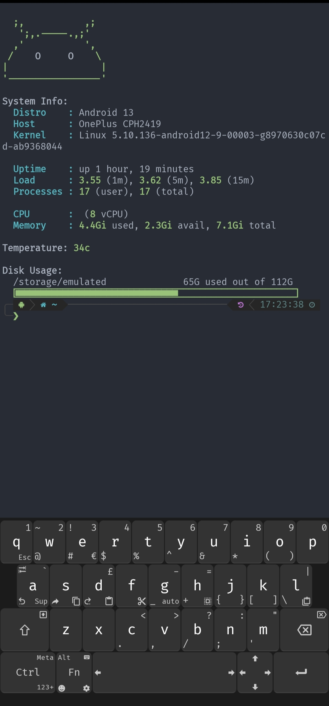

# Message of the Day

A collection of 'Message of the Day' scripts for [Termux](https://termux.com/).

More Screenshots

### Requirements

* figlet (termux-banner only)
* [FiraCode NerdFont](https://github.com/tonsky/FiraCode) (disk-space progress bar ligatures)
* [Unexpected Keyboard](https://f-droid.org/packages/juloo.keyboard2/)

<!-- ## Install
    wget -qO- https://git.io/Jm5hb | bash
-->

**Manually**

    rm -rf /data/data/com.termux/files/usr/etc/motd
    git clone https://github.com/GR3YH4TT3R93/termux-motd.git /data/data/com.termux/files/usr/etc/motd
    echo "/data/data/com.termux/files/usr/etc/motd/init.sh" >> /data/data/com.termux/files/usr/etc/profile # or .zprofile if using zsh

## Configure

**Disable Module:** Disable modules adding ``.disabled`` to the end of file. (e.g. ``10-android-logo-small.disabled``)
**Enable Module:** Remove ``.disabled`` from filename to enable module.

## Credits

* [yboetz/motd](https://github.com/yboetz/motd) (Orignal work)
* [generator/termux-motd](https://github.com/Generator) (Contributor)
